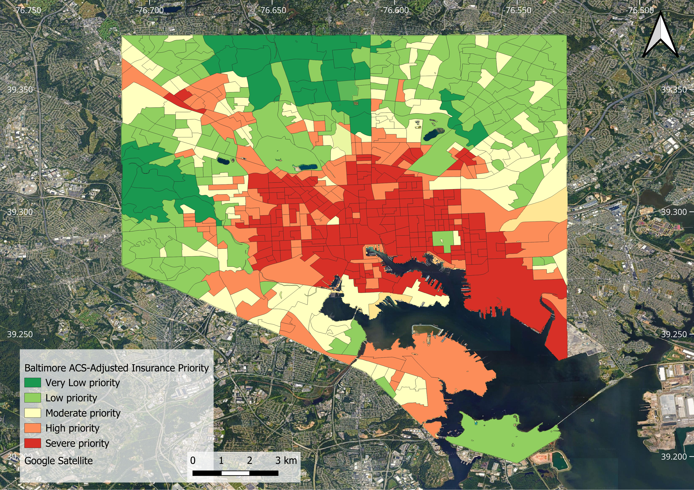

# Where Do Urban Heat Risk and Household Vulnerability Overlap in Baltimore?

## Overview

This project begins with a **Google Earth Engine-based urban heat-risk workflow** for Baltimore City, Maryland. Google Earth Engine was the foundation of the analysis because it was used to process satellite imagery, mask out water bodies, calculate land surface temperature and vegetation indicators, create the pixel-level urban heat-risk surface, and aggregate heat-risk metrics to Census Block Groups.

The Google Earth Engine outputs were then combined with American Community Survey indicators to produce an interpretable **ACS-adjusted heat-insurance priority score** at the Census Block Group level.

The final workflow identifies where physical heat exposure, impervious urban surfaces, low vegetation, and household vulnerability overlap across Baltimore. 

This portfolio project demonstrates how satellite-derived urban heat metrics and census-based vulnerability indicators can be combined into a practical screening layer for climate-risk, insurance, and resilience planning.

This is not a deterministic insurance-claims model. It is a spatial decision-support framework for identifying areas that may require deeper review, field validation, parcel-level analysis, insurance portfolio screening, or targeted adaptation investment.

---

## Key Question

**Where do Google Earth Engine-derived urban heat exposure and household vulnerability overlap most strongly across Baltimore Census Block Groups?**

---

## Project Logic

The workflow follows a clear sequence:

1. **Google Earth Engine created the physical urban heat-risk foundation.**
2. The heat-risk surface was summarized by Census Block Group.
3. American Community Survey indicators were added to represent household vulnerability.
4. A final ACS-adjusted heat-insurance priority score was calculated.
5. The results were visualized in QGIS and prepared for GitHub portfolio presentation.

In simple terms:

Google Earth Engine produced the heat-risk evidence.  
American Community Survey data added the vulnerability context.  
The final score identifies priority Census Block Groups for climate-risk and insurance-oriented decision support.

---

## Why This Project Matters

Urban heat risk is not only a physical hazard problem. The same land surface temperature can have different consequences depending on household income, renter status, vehicle access, housing conditions, age vulnerability, and adaptive capacity.

This project combines:

- Google Earth Engine satellite processing
- Landsat-derived land surface temperature
- Vegetation and built-up indicators
- Impervious surface data
- Population exposure
- Census Block Group aggregation
- American Community Survey vulnerability indicators
- QGIS visualization
- Insurance-oriented priority scoring

The result is a neighborhood-scale index that can support climate-risk communication, environmental justice screening, insurance portfolio analysis, and urban resilience planning.

---

## Study Area

- Location: Baltimore City, Maryland
- Spatial unit: Census Block Group
- Total Baltimore Census Block Groups: 618
- Analysis period: Summer 2020 to 2024
- Season: June to September
- Water bodies: fully masked out of the analysis

---

## Main Results

### 1. Google Earth Engine-Derived Pixel-Level Urban Heat Risk

This map shows the fine-scale urban heat-risk surface generated from Google Earth Engine after water bodies were fully masked out.

The highest heat-risk areas are concentrated in dense, highly impervious, low-vegetation urban zones. Lower-risk areas generally correspond to greener neighborhoods, parks, forested areas, and less impervious surfaces.

This raster surface is the foundation for the downstream Census Block Group scoring.

---

### 2. Distribution of Heat-Risk Categories

This chart summarizes the percentage of Census Block Groups in each heat-risk category.

A substantial share of Baltimore falls into the **High** and **Moderate** heat-risk classes, while the **Very Low** category represents only a small portion of the city.

---

### 3. Census Block Group Priority Map

This map shows the final Census Block Group-level priority pattern after the Google Earth Engine heat-risk outputs were combined with American Community Survey vulnerability indicators.

This is the strongest decision-support figure because it connects satellite-derived physical heat exposure with household vulnerability at a policy relevant geography.

---

## Google Earth Engine Workflow

Google Earth Engine was used to create the physical heat-risk foundation of the project.

The workflow included:

1. Loading the Baltimore City boundary.
2. Loading Census Block Groups.
3. Defining the summer analysis period from 2020 to 2024.
4. Loading Landsat 8 and Landsat 9 Collection 2 Level 2 imagery.
5. Applying cloud, cloud-shadow, cirrus, and dilated-cloud masking.
6. Calculating land surface temperature, NDVI, and NDBI.
7. Loading NLCD impervious surface data.
8. Loading population data.
9. Masking out water bodies using JRC Global Surface Water and NLCD open water.
10. Normalizing physical indicators using robust percentile normalization.
11. Building a pixel-level urban heat-risk index.
12. Classifying heat-risk categories.
13. Aggregating raster indicators to Census Block Groups.
14. Computing Census Block Group-level heat-risk priority scores.
15. Exporting maps, CSV tables, and shapefiles for downstream analysis and visualization.

---

## Google Earth Engine-Derived Pixel-Level Urban Heat-Risk Index

The pixel-level urban heat-risk index was calculated in Google Earth Engine using normalized physical and exposure indicators.

Urban heat risk was calculated as:

> Urban_Heat_Risk =  
> 0.40 × normalized land surface temperature  
> + 0.20 × low vegetation  
> + 0.15 × normalized built-up intensity  
> + 0.15 × normalized impervious surface  
> + 0.10 × normalized population

This index captures the fine-scale spatial structure of heat hazard before aggregation to Census Block Groups.

---

## Water-Body Masking in Google Earth Engine

Water bodies were fully removed from the analysis before calculating heat-risk scores.

Water was identified using:

- JRC Global Surface Water occurrence
- NLCD open water class

Water pixels were converted to NoData or transparency before calculating heat-risk scores. This prevents harbors, rivers, reservoirs, and open-water pixels from artificially lowering or distorting neighborhood heat-risk estimates.

---

## From Google Earth Engine to ACS-Adjusted Priority Scoring

After the Google Earth Engine workflow produced the physical heat-risk outputs, the results were joined with American Community Survey indicators.

The final ACS-adjusted heat-insurance priority score was calculated as:

> insurance_heat_acs_priority_score =  
> 0.50 × base_heat_priority_for_insurance  
> + 0.20 × supplemental_heat_hazard_score  
> + 0.30 × acs_insurance_vulnerability_score

Higher values indicate greater priority for heat-risk screening, insurance review, and adaptation-focused decision support.

---

## Final Score Components

| Component | Weight | Purpose |
|---|---:|---|
| Base heat priority for insurance | 50% | Main heat-risk and insurance-priority backbone, normalized from the original Google Earth Engine-derived heat-risk priority score |
| Supplemental heat-hazard score | 20% | Adds physical heat-hazard information from land surface temperature, imperviousness, built-up intensity, low vegetation, and high-risk heat area |
| ACS insurance vulnerability score | 30% | Adjusts the score using household and social vulnerability indicators from American Community Survey data |

---

## Step 1: Base Heat Priority for Insurance

The base heat component is the min-max normalized version of the original `Priority_Score`.

> base_heat_priority_for_insurance =  
> (Priority_Score - minimum Priority_Score) /  
> (maximum Priority_Score - minimum Priority_Score)

For the Baltimore dataset:

| Statistic | Value |
|---|---:|
| Minimum Priority_Score | 0.0431042225 |
| Maximum Priority_Score | 0.9332001028 |

This converts the original score into a 0 to 1 index, where 0 is the lowest observed Baltimore Census Block Group value and 1 is the highest observed Baltimore Census Block Group value.

---

## Step 2: Supplemental Heat-Hazard Score

The supplemental heat-hazard score is an equally weighted average of five normalized physical indicators.

> supplemental_heat_hazard_score =  
> 0.20 × land surface temperature score  
> + 0.20 × impervious surface score  
> + 0.20 × built-up score  
> + 0.20 × low vegetation score  
> + 0.20 × high-risk heat area score

| Indicator | Interpretation |
|---|---|
| Land surface temperature score | Higher land surface temperature means higher heat hazard |
| Impervious surface score | Higher imperviousness means greater heat retention and runoff-related exposure |
| Built-up score | Higher built-up intensity indicates stronger urban heat structure |
| Low vegetation score | Lower vegetation increases heat hazard |
| High-risk heat area score | Higher percentage of a Census Block Group in high-risk heat pixels increases exposure |

---

## Step 3: ACS Insurance Vulnerability Score

The ACS vulnerability score represents household and social conditions that may increase sensitivity to heat or reduce adaptive capacity.

> acs_insurance_vulnerability_score =  
> 0.20 × population exposure score  
> + 0.20 × age vulnerability score  
> + 0.25 × socioeconomic stress score  
> + 0.25 × housing and adaptive capacity score  
> + 0.10 × environmental justice context score

| ACS component | Weight | Meaning |
|---|---:|---|
| Population exposure | 20% | More people potentially exposed within the Census Block Group |
| Age vulnerability | 20% | Higher vulnerability from older adults and children under 5 |
| Socioeconomic stress | 25% | Economic and education-related stress |
| Housing and adaptive capacity stress | 25% | Renter occupancy, no-vehicle access, rent burden, vacancy, and older housing |
| Environmental justice context | 10% | Environmental justice context represented by people-of-color share |

---

## Top 50 Priority Census Block Groups Compared With the Citywide Average

The Top 50 priority Census Block Groups are hotter, more impervious, less vegetated, and more socioeconomically constrained than the citywide average.

| Indicator | Citywide average | Top 50 priority CBGs |
|---|---:|---:|
| Priority score | 0.490 | 0.732 |
| Urban heat risk | 0.591 | 0.847 |
| Land surface temperature | 39.9 °C | 43.8 °C |
| Impervious surface | 57.9% | 87.9% |
| NDVI / vegetation | 0.431 | 0.211 |
| High-risk heat area | 52.4% | 99.1% |
| ACS vulnerability score | 0.346 | 0.392 |
| Median household income | $74,783 | $56,787 |
| Renter occupied | 49.6% | 69.0% |
| No-vehicle households | 27.5% | 44.1% |
| Less than high school | 12.8% | 18.1% |

### Interpretation

Compared with the citywide average, the Top 50 priority Census Block Groups have:

- Higher overall priority scores
- Higher urban heat risk
- Higher land surface temperatures
- Much higher impervious surface coverage
- Lower vegetation
- Nearly complete high-risk heat-area coverage
- Lower median household income
- Higher renter occupancy
- Higher no-vehicle household share
- Higher share of adults with less than high school education

This supports the interpretation that the highest-priority areas are not only physically hotter, but also have weaker household adaptive capacity.

---

## Worked Example: Highest-Priority Census Block Group

The highest-priority Census Block Group in the joined file is:

| Field | Value |
|---|---:|
| GEOID | 245102805002 |
| Base heat priority for insurance | 1.000000 |
| Supplemental heat-hazard score | 0.960993 |
| ACS insurance vulnerability score | 0.436840 |
| Final priority score | 0.823251 |

Calculation:

> 0.50 × 1.000000  
> + 0.20 × 0.960993  
> + 0.30 × 0.436840  
> = 0.823251

This Census Block Group ranks highest because it combines very high physical heat exposure with meaningful ACS-based vulnerability.

---

## Recommended Use Cases

This workflow can support:

- Climate-risk screening
- Insurance portfolio triage
- Heat adaptation planning
- Urban tree-planting prioritization
- Environmental justice screening
- Community resilience targeting
- Parcel-level follow-up analysis
- Neighborhood-scale risk storytelling

---

## What the Score Can and Cannot Say

| The score can support | The score should not claim |
|---|---|
| Screening Census Block Groups where heat exposure and household vulnerability overlap | It should not be interpreted as a deterministic prediction of insurance claims |
| Prioritizing field review, outreach, adaptation investment, or deeper parcel-level analysis | It should not identify individual properties as claim-generating without property and claims data |
| Portfolio-risk storytelling when combined with property exposure or policy-value data | It should not replace underwriting, actuarial, or claims models |

---

## Data-Quality Notes

The joined file contains 618 Baltimore Census Block Group rows, but 613 rows have valid final priority scores.

Five Census Block Groups are missing final scores. These should be reviewed before using the dataset for final reporting or operational decision-making.

The poverty field was not available in the uploaded joined file. Therefore, the current ACS vulnerability score should not be described as directly using poverty until that variable is fixed or regenerated.

The tier counts are close to balanced, suggesting that the tiering behaves like a quantile-style classification. Because of this, the spatial pattern and top-ranked Census Block Groups are more important than the raw number of Census Block Groups in each tier.

---

## Insurance and Portfolio-Risk Extension

To translate this into a stronger insurance-risk product, the next step is to add property or portfolio exposure data.

Useful next layers include:

- Building footprints
- Parcel boundaries
- Property value
- Insured value
- Policy count
- Claim history
- Roof type
- Building age
- Air-conditioning access, if available
- Tree canopy coverage
- Flood or compound-risk layers

With these additions, the current Census Block Group priority score can be extended to answer portfolio-level questions such as:

- Which insured properties are most exposed?
- How much portfolio value is located in high-priority heat-risk Census Block Groups?
- Where should underwriting review be tightened?
- Which neighborhoods show overlapping climate and household vulnerability?
- Which locations should be prioritized for mitigation, inspection, or outreach?

---

## Main Fields

| Field | Description |
|---|---|
| GEOID | Census Block Group identifier |
| LST_C | Land surface temperature in degrees Celsius |
| NDVI | Normalized Difference Vegetation Index |
| NDBI | Normalized Difference Built-up Index |
| Impervious | Impervious surface percentage |
| Urban_Heat_Risk | Google Earth Engine-derived heat-risk score aggregated to Census Block Group |
| High_Risk_Area_Percent | Percent of Census Block Group land area classified as high heat risk |
| acs_insurance_vulnerability_score | ACS-derived household vulnerability score |
| insurance_heat_acs_priority_score | Final ACS-adjusted heat-insurance priority score |
| insurance_heat_acs_priority_tier | Final categorical priority tier |

---

## Technical Stack

- Google Earth Engine
- Landsat 8 and Landsat 9 Collection 2 Level 2
- NLCD 2021
- JRC Global Surface Water
- Census TIGER/Line boundaries
- American Community Survey indicators
- QGIS
- Python or R for post-processing and visualization
- GitHub for project documentation

---

## Summary

This project demonstrates an end-to-end geospatial climate-risk analytics workflow built first in **Google Earth Engine**.

Google Earth Engine was used to process satellite imagery, mask water bodies, calculate heat-risk indicators, and generate the spatial heat-risk foundation. The outputs were then combined with American Community Survey vulnerability indicators to produce a Census Block Group-level priority score for Baltimore City.

The final product is a clear, interpretable, map-based decision-support workflow that identifies where urban heat exposure and household vulnerability overlap most strongly.

---

## Author

**Itohan-Osa Abu**  
Geospatial AI Scientist | Remote Sensing | GIS Automation | Climate Analytics
