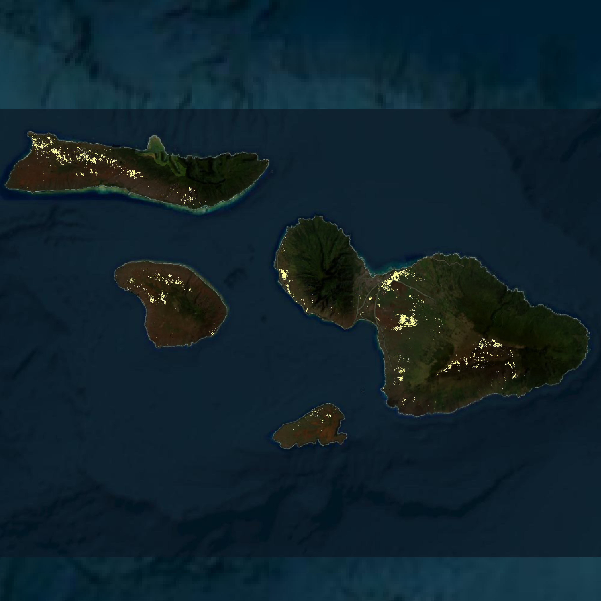

# Maui Wildfires: Burned Area, Vegetation Recovery, Population Exposure, and Land-Cover Impact

This project analyzes the spatial and environmental impacts of the Maui wildfires using geospatial visualization, burned-area mapping, vegetation monitoring, and exposure analysis. The project focuses on identifying wildfire-affected areas, observing vegetation recovery through NDVI, and visualizing impacts on population, cropland, and grassland areas.

---

## Project Overview

The Maui wildfires caused severe environmental, social, and economic impacts. This project uses geospatial data and visual outputs to communicate where the fires occurred, how burned areas changed, and which land-cover and population groups were affected.

The analysis includes:

- Wildfire occurrence and burned-area visualization
- Maui area of interest mapping
- Burned-area mapping
- NDVI-based vegetation recovery monitoring
- Population exposure assessment
- Cropland impact assessment
- Grassland impact assessment
- Cost and impact visualization

---

## Study Area: Maui, Hawaii

The project begins by defining the Maui area of interest. This map shows the selected study boundary used for the wildfire analysis.

<p align="center">
  
</p>

The area of interest provides the spatial boundary for subsequent burned-area, vegetation, and impact analyses.

---

## Methodological Workflow

The workflow below summarizes the major steps followed in this project, from data collection and preprocessing to wildfire mapping, impact assessment, and visualization.

<p align="center">
  
</p>

The workflow helps explain how wildfire data, satellite-derived vegetation information, and exposure layers were combined to produce the final outputs.

---

## Wildfires Across the United States, Alaska, and Hawaii

This animation shows wildfire activity from 2016 to 2023 across the United States, including Alaska and Hawaii. It provides broader context before focusing specifically on Maui.

<p align="center">
  <video src="figures/Fires_2016_2023.mp4" width="850" controls>
    Your browser does not support the video tag.
  </video>
</p>

If the video does not display directly on GitHub, download or open the file here:

[View Fires_2016_2023.mp4](figures/Fires_2016_2023.mp4)

This national-scale visualization helps place the Maui wildfire event within a broader wildfire pattern across the United States.

---

## Burned Areas in Maui

The burned-area map identifies locations affected by wildfire within the Maui study area.

<p align="center">
  
</p>

The burned-area layer is central to the project because it defines the spatial footprint used to estimate environmental and human impacts.

---

## NDVI-Based Vegetation Recovery

The NDVI animation shows vegetation condition and recovery after the wildfire event. NDVI is useful for tracking vegetation stress, damage, and regrowth over time.

<p align="center">
  <video src="figures/NDVI.mp4" width="850" controls>
    Your browser does not support the video tag.
  </video>
</p>

If the video does not display directly on GitHub, download or open the file here:

[View NDVI.mp4](figures/NDVI.mp4)

This animation helps show how vegetation changed after the wildfire and whether affected areas began to recover.

---

## Population Affected by the Wildfires

This map shows areas where population exposure overlapped with wildfire-affected zones.

<p align="center">
  
</p>

The population exposure map highlights the human dimension of the wildfire impact. It helps identify communities that may have been directly or indirectly affected by the burned areas.

---

## Cropland Affected by the Wildfires

This map shows cropland areas affected by the Maui wildfires.

<p align="center">
  
</p>

The cropland impact layer helps assess potential agricultural damage and the effect of wildfire on productive land.

---

## Grassland Affected by the Wildfires

This map shows grassland areas affected by the wildfire event.

<p align="center">
  
</p>

Grassland areas are important because they can influence fire spread, post-fire recovery, and future wildfire vulnerability.

---

## Economic Cost and Wildfire Impact

This animation presents the cost and broader impact of wildfires.

<p align="center">
  <video src="figures/cost%20of%20wildfires_with_name.mp4" width="850" controls>
    Your browser does not support the video tag.
  </video>
</p>

If the video does not display directly on GitHub, download or open the file here:

[View cost of wildfires_with_name.mp4](figures/cost%20of%20wildfires_with_name.mp4)

This visualization connects the physical wildfire footprint with the broader economic and societal consequences of wildfire events.

---

## Key Outputs

The project produces the following visual outputs:

| Output | File |
|---|---|
| Maui area of interest | `maui_aoi_ll.png` |
| Project workflow | `flowchart.png` |
| United States wildfire animation, 2016–2023 | `Fires_2016_2023.mp4` |
| Burned areas | `burnt areas.png` |
| NDVI vegetation recovery animation | `NDVI.mp4` |
| Affected population | `affected pop.png` |
| Affected cropland | `affected cropland.png` |
| Affected grassland | `grassland.png` |
| Wildfire cost animation | `cost of wildfires_with_name.mp4` |

---

## Repository Structure

```text
maui-wildfires/
│
├── README.md
│
└── figures/
    ├── .gitkeep
    ├── Fires_2016_2023.mp4
    ├── NDVI.mp4
    ├── affected cropland.png
    ├── affected pop.png
    ├── burnt areas.png
    ├── cost of wildfires_with_name.mp4
    ├── flowchart.png
    ├── grassland.png
    └── maui_aoi_ll.png
