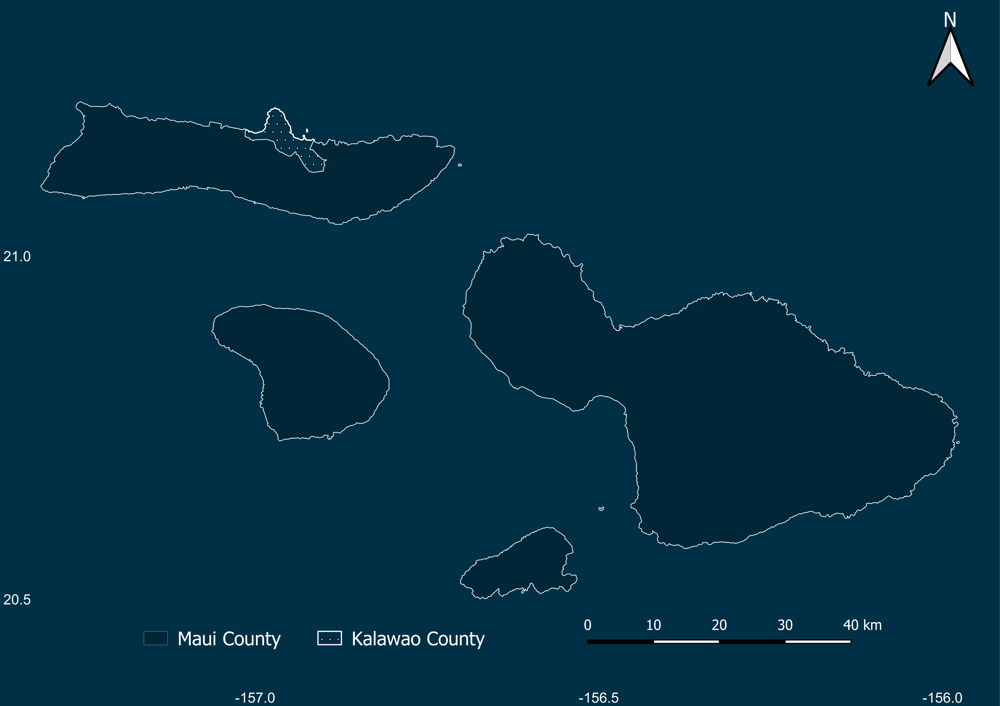
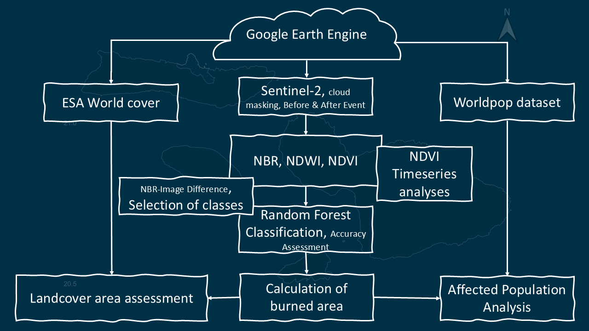

# Maui Wildfires 2023: Geospatial Intelligence for Burn Severity, Population Exposure, and Ecosystem Recovery

## Project Summary

The August 2023 Maui wildfires were among the deadliest and most destructive wildfire events in modern U.S. history. Rapid assessment of wildfire impacts is critical for emergency response, environmental monitoring, recovery planning, and long-term resilience.

This project demonstrates a cloud-based geospatial intelligence workflow developed in Google Earth Engine to quantify wildfire impacts using satellite imagery, land-cover datasets, and population estimates.

The analysis integrates:

- Sentinel-2 multispectral imagery
- ESA WorldCover land-cover data
- WorldPop population estimates
- Time-series vegetation monitoring
- Burn severity assessment

to evaluate wildfire extent, environmental damage, population exposure, and post-fire ecosystem recovery.

---

# Why This Matters

Wildfires are increasing in frequency, duration, and severity due to climate change, prolonged drought conditions, and land-use pressures.

Decision makers require rapid and scalable methods to answer critical questions:

- How much land was burned?
- Which land-cover classes were affected?
- How many people were exposed?
- How quickly is vegetation recovering?
- What are the potential long-term impacts?

This project demonstrates how Earth Observation can support evidence-based disaster management.

---

# Historical Wildfire Activity

To provide context, wildfire occurrence across the United States, Alaska, and Hawaii was analyzed using historical wildfire records.

🎥 **Animation**

[View Historical Wildfire Animation](figures/Fires_2016_2023.mp4)

The animation highlights the increasing spatial extent and frequency of wildfire events across North America.

---

# Study Area

The analysis focuses on Maui County, Hawaii, including Maui, Molokai, and Lanai.

Maui experienced extensive wildfire damage during August 2023, particularly around Lahaina and surrounding communities.

*Figure 1. Study area showing Maui County and surrounding islands.*

---

# Analytical Framework

A cloud-based workflow was implemented within Google Earth Engine.

The workflow consists of:

1. Satellite image acquisition
2. Pre-processing and cloud masking
3. Burn severity assessment
4. Population exposure estimation
5. Land-cover impact analysis
6. Vegetation recovery monitoring

*Figure 2. End-to-end wildfire assessment workflow.*

---

# Burn Severity Assessment

Burned areas were identified using spectral change detection techniques derived from Sentinel-2 imagery.

Results indicate approximately:

# 7,174 hectares burned

across Maui County during the wildfire event.

*Figure 3. Burned area distribution across Maui County.*

---

# Land-Cover Impact Assessment

Understanding which ecosystems are most affected is critical for ecological recovery planning.

Results indicate that grassland represented the dominant affected land-cover category.

*Figure 4. Grassland represented the most impacted land-cover class.*

---

# Population Exposure Assessment

Wildfire impacts extend beyond ecosystems and directly affect human populations.

Combining wildfire extent with WorldPop estimates suggests that approximately:

# 160,000 people

were potentially exposed to wildfire impacts.

*Figure 6. Spatial distribution of population exposure.*

---

# Economic Impact

Wildfires generate substantial economic losses through destruction of homes, infrastructure, businesses, and ecosystem services.

🎥 **Economic Impact Animation**

[View Economic Impact Animation](figures/cost of wildfires_with name.mp4)

This animation summarizes the economic consequences associated with major wildfire events.

---

# Vegetation Recovery Analysis

To evaluate ecosystem resilience and post-fire recovery, NDVI time-series analysis was conducted.

Vegetation indices reveal significant declines immediately following the wildfire event followed by gradual recovery over time.

🎥 **NDVI Recovery Animation**

[View NDVI Recovery Animation](figures/NDVI.mp4)

The animation demonstrates temporal vegetation dynamics throughout the recovery period.

---

# Key Findings

✅ Approximately **7,174 hectares** burned

✅ Grassland represented the most affected land-cover category

✅ Approximately **160,000 people** potentially exposed

✅ Significant vegetation loss observed immediately following the wildfire

✅ Progressive vegetation recovery observed through NDVI monitoring

✅ Google Earth Engine enabled rapid, scalable disaster assessment

---

# Technologies Used

| Category | Technology |
|-----------|------------|
| Cloud Computing | Google Earth Engine |
| Remote Sensing | Sentinel-2 |
| Land Cover | ESA WorldCover |
| Population | WorldPop |
| GIS | ArcGIS Pro, QGIS |
| Programming | JavaScript |
| Analysis | Spectral Change Detection |
| Monitoring | NDVI Time Series |

---

# Skills Demonstrated

- Remote Sensing
- Earth Observation
- Burn Severity Mapping
- Disaster Risk Assessment
- Population Exposure Analysis
- Environmental Monitoring
- Time-Series Analysis
- Geospatial Intelligence
- GIS Automation
- Google Earth Engine

---

# Project Impact

This project demonstrates how cloud-based geospatial analytics and Earth Observation data can support rapid disaster assessment workflows that are scalable, reproducible, and actionable for emergency management agencies, environmental organizations, and policy makers.
---

# Project Presentation

A detailed presentation describing the project background, methodology, datasets, analytical workflow, results, and key findings is available below.

📄 **Presentation Slides**

[⬇ Download Project Presentation](Maui_Fires_12.04.24.pdf)

The presentation includes:

- Wildfire background and motivation
- Maui wildfire case study
- Sentinel-2 data processing workflow
- Burn severity assessment
- Land-cover impact analysis
- Population exposure assessment
- NDVI recovery monitoring
- Key findings and conclusions

---
---

# Author

## Itohan-Osa Abu

**Geospatial AI Scientist | Remote Sensing | GIS Automation | Climate Analytics**

Specializing in Earth Observation, Environmental Monitoring, Geospatial Intelligence, and Machine Learning for environmental applications.
